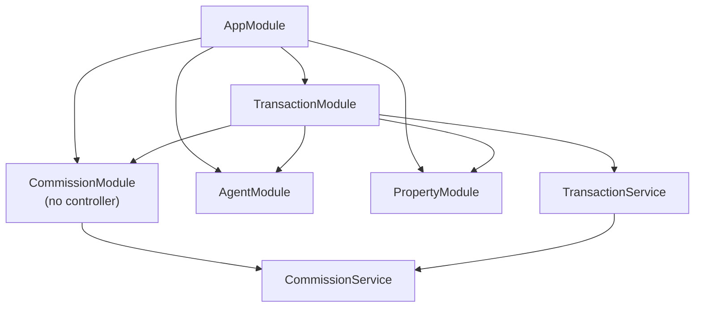
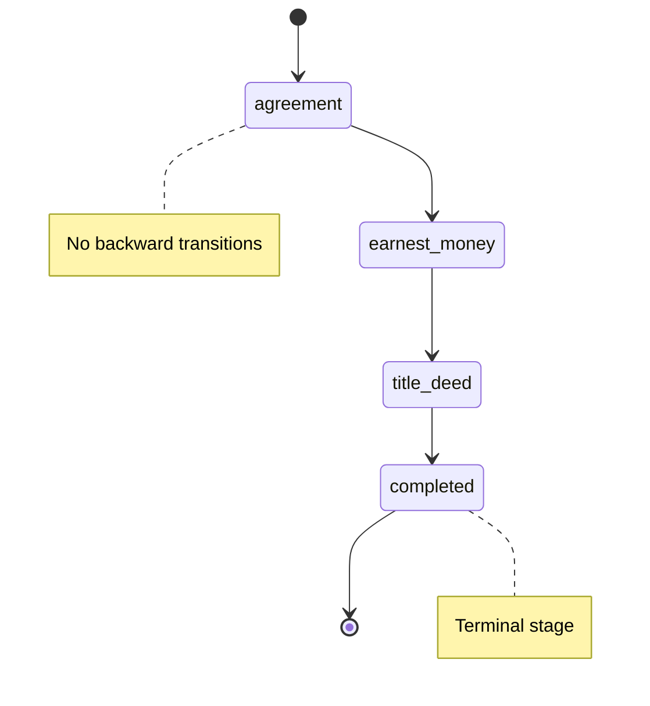

# Design Document — Iceberg Case App

This document captures the current design decisions behind the transaction and commission flow in the application:

1. [Mongoose Schema Design](#1-mongoose-schema-design)
2. [CommissionModule as a Controller-less Domain Service](#2-commissionmodule-as-a-controller-less-domain-service)
3. [Transaction Lifecycle and State Machine](#3-transaction-lifecycle-and-state-machine)
4. [Frontend Flow and UI Responsibilities](#4-frontend-flow-and-ui-responsibilities)

The application also contains additional modules such as `HealthModule` and `ItemsModule`, but they are outside the scope of this document. The focus here is the transaction lifecycle, commission calculation, and the UI flow built on top of them.

---

## 1. Mongoose Schema Design

### 1.1 Collection Boundaries

The core business flow uses three MongoDB collections:

| Collection     | Schema Class  | Purpose                                     |
| -------------- | ------------- | ------------------------------------------- |
| `agents`       | `Agent`       | Real-estate agent identity and contact data |
| `properties`   | `Property`    | Listed property records                     |
| `transactions` | `Transaction` | Transaction lifecycle and commission state  |

`agents` and `properties` are stored in `transactions` as references (`ObjectId`), not as duplicated full documents. This keeps those collections independently queryable and updateable.

### 1.2 Reference vs. Embedded Modeling

#### Referenced fields

```text
Transaction.propertyId      -> ObjectId (ref: Property)
Transaction.listingAgentId  -> ObjectId (ref: Agent)
Transaction.sellingAgentId  -> ObjectId (ref: Agent)
Property.listingAgentId     -> ObjectId (ref: Agent)
```

Why references are used:

- `Agent` and `Property` have their own lifecycle and can be updated independently.
- References preserve a single source of truth for shared business entities.
- This keeps the model open to future `populate` or aggregation-based queries.

#### Embedded structures

The `Transaction` document embeds two substructures:

```text
Transaction
 |- stageHistory: StageHistoryEntry[]
 |   \- { stage, changedAt }
 \- commissionBreakdown: CommissionBreakdown | undefined
     |- agency: number
     |- calculatedAt: Date
     |- ruleVersion: string
     \- agents: AgentSnapshot[]
         \- { agentId, name, role, amount }
```

The following class diagram summarizes the persisted transaction model and the main embedded/reference relationships used by the current implementation.


Why `stageHistory` is embedded:

- Stage changes belong only to a single transaction.
- The history is always read together with the transaction detail.
- Splitting it into another collection would add join cost without improving the model.

Why `commissionBreakdown` is embedded:

- Commission is calculated exactly once during `title_deed -> completed`.
- The result should stay attached to the transaction as an audit snapshot.
- Historical payout data must remain stable even if agent records change later.

Why `AgentSnapshot` is embedded inside `commissionBreakdown`:

- The commission record must preserve the name and role used at calculation time.
- `agentId` is still retained for traceability.
- UI display does not need to depend on the live `agents` collection to render a completed commission breakdown.

This follows a point-in-time snapshot pattern commonly used in finance-oriented systems.

#### Why `_id: false` and `versionKey: false` are used

`AgentSnapshot`, `CommissionBreakdown`, and `StageHistoryEntry` are defined with `{ _id: false, versionKey: false }`.

These subdocuments do not need their own identity or versioning metadata. Disabling both keeps the stored transaction payload compact and avoids document noise.

### 1.3 Why `stage` Explicitly Uses `type: String`

```typescript
@Prop({ required: true, type: String, enum: TRANSACTION_STAGES })
stage: TransactionStage;
```

`TransactionStage` is a TypeScript union type backed by `as const` values. Mongoose cannot reliably infer that type through runtime metadata alone, especially in testing and schema registration paths. Explicitly setting `type: String` avoids ambiguous type resolution while `enum` still protects database-level validity.

---

## 2. CommissionModule as a Controller-less Domain Service

### 2.1 Module Shape

```text
src/commission/
|- commission.module.ts
\- commission.service.ts
```

```typescript
@Module({
  providers: [CommissionService],
  exports: [CommissionService]
})
export class CommissionModule {}
```

`CommissionModule` intentionally has no controller.

### 2.2 Why There Is No Controller

Commission calculation is not treated as an HTTP resource. It is a domain rule invoked by the transaction lifecycle.

Reasons for that decision:

1. There is a single valid trigger point.  
   `CommissionService.calculate()` is only called when `TransactionService.updateStage()` moves a transaction from `title_deed` to `completed`.

2. The service should stay pure.  
   `CommissionService` handles only calculation and snapshot construction. It has no awareness of HTTP, request validation, or persistence.

3. Recalculation should be tightly controlled.  
   A public `/commission/calculate` style endpoint would make it easier to bypass lifecycle rules and recalculate completed transactions incorrectly. This prevents external actors from triggering commission calculations outside the transaction lifecycle, preserving domain integrity.

4. It remains easy to unit test.  
   The service behaves like a deterministic business function over well-defined inputs.

### 2.3 Dependency Flow

At the application level, `AppModule` imports `AgentModule`, `PropertyModule`, `CommissionModule`, and `TransactionModule`. Inside the transaction domain, `TransactionModule` imports the modules it depends on and `TransactionService` injects `CommissionService` plus the `Agent` model.

Conceptually, the runtime dependency flow looks like this:

```text
AppModule
 |- AgentModule
 |- PropertyModule
 |- CommissionModule
 \- TransactionModule
     |- imports CommissionModule
     |- imports AgentModule
     \- TransactionService -> CommissionService
```

The following diagram shows the high-level module interaction exactly as implemented today. `CommissionModule` exposes `CommissionService` without any controller, and `TransactionService` depends on that service.



The important design point is that commission calculation is orchestrated by the transaction domain, not exposed directly as its own API workflow.

### 2.4 `calculate()` Contract

```typescript
calculate(
  totalServiceFee: number,
  listingAgent: { agentId, name },
  sellingAgent: { agentId, name },
): CommissionBreakdown
```

The method:

- does not check stages; that responsibility belongs to `TransactionService`
- does not talk to the database
- always returns a new `CommissionBreakdown` object

### 2.5 Implemented Commission Rule (`v1`)

The current implementation follows this exact rule:

- `agency = totalServiceFee * 0.5`
- `agentPool = totalServiceFee * 0.5`
- if the listing and selling agents are the same person:
  - create one `AgentSnapshot`
  - set `role` to `both`
  - assign the full `agentPool` to that one agent
- if they are different:
  - create two `AgentSnapshot` entries
  - assign `role: listing` to the listing agent
  - assign `role: selling` to the selling agent
  - split the `agentPool` equally between them
- include `ruleVersion: 'v1'`
- stamp `calculatedAt` with the calculation time

The inclusion of `ruleVersion` allows future commission policy changes without changing the meaning of historical transaction records. This preserves backward compatibility for previously completed financial outcomes.

For simplicity, commission values are currently handled as JavaScript numbers. In a production-grade financial system, a decimal or fixed-point representation would usually be preferred to avoid floating-point precision issues.

---

## 3. Transaction Lifecycle and State Machine

### 3.1 Stage Set

```text
agreement -> earnest_money -> title_deed -> completed
```

| Stage           | Meaning                             | Commission            |
| --------------- | ----------------------------------- | --------------------- |
| `agreement`     | Initial agreement / handshake stage | Not calculated        |
| `earnest_money` | Earnest money stage                 | Not calculated        |
| `title_deed`    | Title deed transfer stage           | Not calculated        |
| `completed`     | Terminal completed stage            | Calculated and locked |

The transaction lifecycle is implemented as a strict state machine. The diagram below shows the only valid forward path, with `completed` as the terminal stage and no backward transitions.



### 3.2 Allowed Transitions

`TransactionService` defines a strict linear transition map:

```typescript
private readonly allowedTransition: Record<TransactionStage, TransactionStage | null> = {
  agreement: 'earnest_money',
  earnest_money: 'title_deed',
  title_deed: 'completed',
  completed: null,
};
```

Only the next stage is allowed. Skipping stages or moving backward is invalid.

### 3.3 API Surface

The transaction domain currently exposes these REST endpoints:

```text
POST   /api/transactions
GET    /api/transactions
GET    /api/transactions/:id
PATCH  /api/transactions/:id/stage
```

Additional lookup endpoints support the UI:

```text
GET /api/agents
GET /api/properties
```

### 3.4 Enforced Constraints

| Situation                                          | Result                                                              |
| -------------------------------------------------- | ------------------------------------------------------------------- |
| Transaction does not exist                         | `404 NotFoundException`                                             |
| Attempt to change a `completed` transaction        | `400 BadRequestException: Transaction is completed`                 |
| Attempt to skip or reorder stages                  | `400 BadRequestException: Invalid stage transition from ... to ...` |
| Missing listing or selling agent during completion | `404 NotFoundException`                                             |

### 3.5 Special Meaning of `title_deed -> completed`

The transition to `completed` is more than a stage update. It is the moment when financial state becomes final.

```text
1. Validate that the next stage is exactly `completed`
2. Load the listing and selling agents
3. Call CommissionService.calculate(...)
4. Embed the returned CommissionBreakdown into the transaction
5. Set completedAt
6. Save the transaction
```

After the transaction reaches `completed`:

- `updateStage()` rejects all further stage updates
- the stored commission snapshot is treated as final
- the API does not expose a separate mutation flow for recalculating commission

This is lifecycle immutability, not a blanket database-level write lock on every field in every context. From a business perspective, the transaction is treated as immutable after completion, and the current API does not expose mutation endpoints that alter either lifecycle state or financial outcome once that terminal state is reached.

Commission is intentionally calculated only at the completion stage to avoid premature financial assumptions. Earlier stages do not guarantee that the transaction will be finalized, so calculating commission before `completed` would risk inconsistent or misleading financial data.

### 3.6 `stageHistory` Behavior

Each transition appends a new history entry:

```typescript
tx.stageHistory.push({ stage: nextStage, changedAt: new Date() })
```

The initial `agreement` entry is created during transaction creation by reusing `agreedAt` as its first `changedAt` value. This makes the history append-only from the beginning of the lifecycle.

---

## 4. Frontend Flow and UI Responsibilities

### 4.1 Frontend Architecture Summary

The Nuxt frontend is built around two Pinia stores:

- `transactions` manages transaction fetch/create/update workflows
- `catalog` loads agents and properties for human-readable lookup data

The frontend uses the transaction APIs for lifecycle operations and uses catalog APIs to resolve IDs into names and titles. The backend acts as the single source of truth for lifecycle and financial rules.

### 4.2 Human-Readable Lookup Strategy

Transaction payloads primarily contain `propertyId`, `listingAgentId`, and `sellingAgentId`. To make the UI usable, the frontend loads `/agents` and `/properties` and resolves those IDs into:

- property titles on the dashboard, list, and detail pages
- listing and selling agent names on the dashboard, list, and detail pages

This keeps backend transaction payloads normalized while still giving the user readable transaction context.

### 4.3 Dashboard, List, and Detail Responsibilities

The current UI is split into three main pages:

- Dashboard  
  Shows aggregate metrics such as total transactions, total service fee, agency earnings from completed transactions, and a recent transaction preview.

- Transaction List  
  Shows the main table of transactions with property title, agent names, stage badge, service fee, and agreement date.

- Transaction Detail  
  Shows transaction metadata, stage progression, stage history, and the commission breakdown once the transaction is completed.

### 4.4 Minimal Transaction Creation Interface

A minimal transaction creation interface is provided to demonstrate end-to-end system flow, while keeping the primary focus on lifecycle and financial logic.

The create flow intentionally stays lightweight:

- select property
- select listing agent
- select selling agent
- enter service fee
- enter agreement date

This is enough to seed a valid transaction and then exercise the main lifecycle path through the stage stepper.

### 4.5 Detail Page Lifecycle Behavior

The transaction detail page mirrors the backend state machine:

- it renders a stage stepper for the four lifecycle stages
- it exposes only the next valid transition as an action
- it hides the commission breakdown until the transaction reaches `completed`
- it renders the embedded agent snapshots from `commissionBreakdown` once completion has happened

The frontend does not enforce business rules independently; it reflects the valid lifecycle path defined by the backend and surfaces the next valid transition through the current API flow. This keeps the UI aligned with the same domain rule enforced by the backend.

---

## Decision Matrix

| Decision | Chosen Approach | Rejected Alternative | Rationale |
| --- | --- | --- | --- |
| `stageHistory` storage | Embedded array | Separate collection | Same lifecycle as the transaction |
| `commissionBreakdown` storage | Embedded object | Separate collection | Stable point-in-time audit snapshot |
| `AgentSnapshot` modeling | Copy name and role into the transaction | Keep only `ObjectId` references | Historical isolation from later agent edits |
| `CommissionModule` shape | Controller-less domain service | Public REST calculation endpoint | Prevents bypassing lifecycle rules |
| Stage transitions | Linear, one-way state machine | Free-form transitions | Enforces business progression |
| Commission trigger | Only on `title_deed -> completed` | Calculate on every stage change | Financial finalization should happen once |
| UI lookup strategy | Resolve IDs through catalog store | Show raw IDs everywhere | Better user readability without denormalizing transactions |
